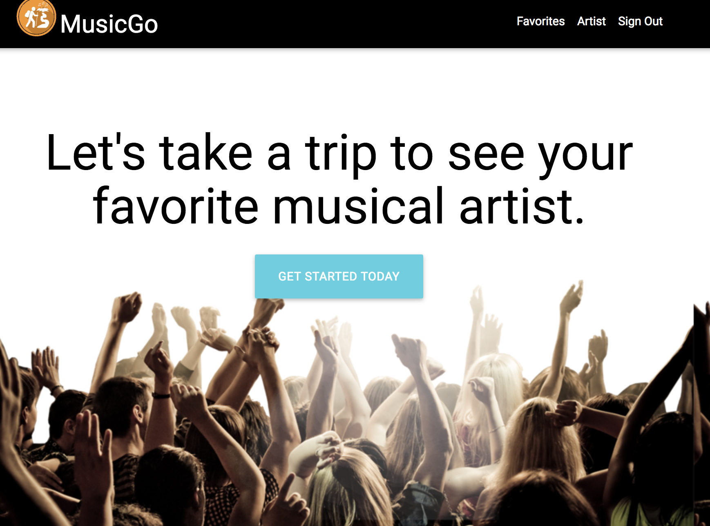
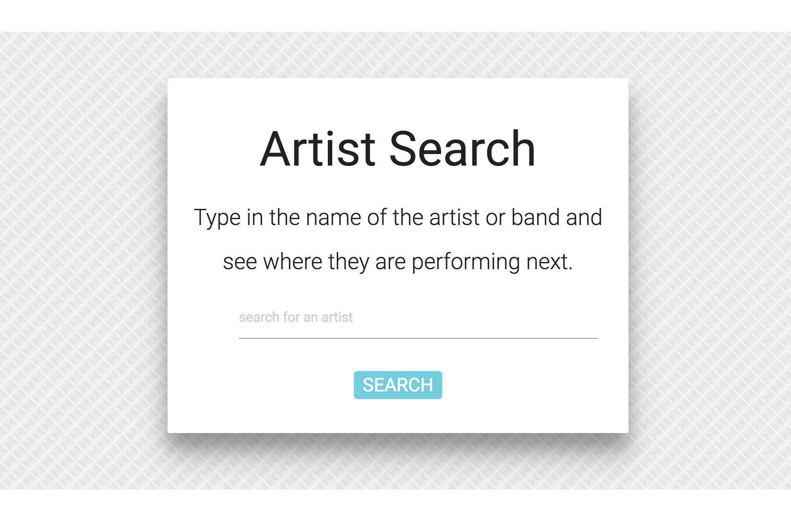
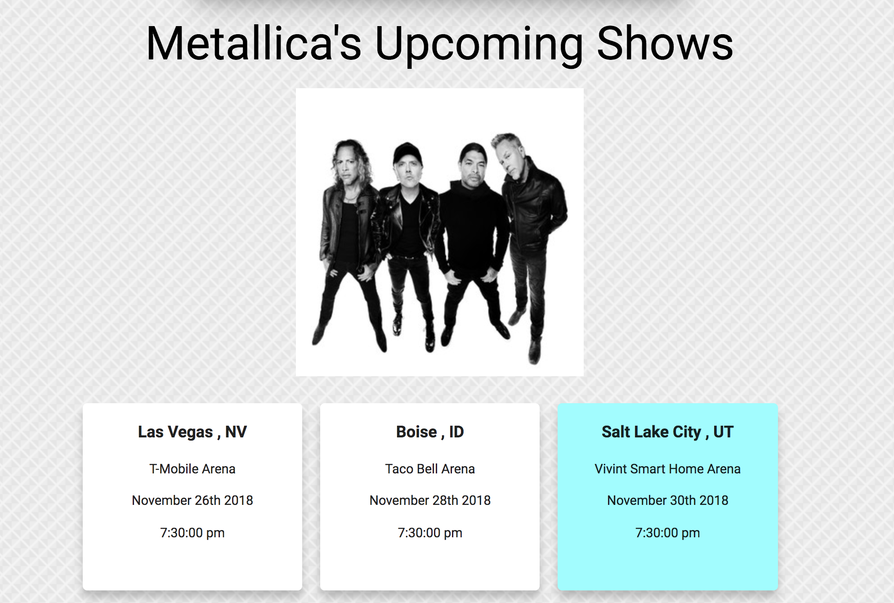

# MusicGo | Plan Your Next Adventure

## Link to Heroku : https://thawing-thicket-74898.herokuapp.com/

## LINK TO VIDEO DEMO:
https://youtu.be/TayeRsPnuW4


### Overview
MusicGo is a full stack application that allows you to search an artist's upcoming tour and plan a trip to go see them. This app was design by a group of 5 developers in UNCC's Coding Bootcamp. Based on the city your artist is performing in, you can browse hotels, restaurants and other local events happening around the area and time of the concert. This app is designed for the modern day groupie, if you love to travel for good music this is a great app for you to explore. Happy travels. 


<br><br>

<br><br>

<br><br>



## Technologies Used

* HTML5, CSS3, JavaScript (ES6)
* NodeJS, Nodemon
* Handlebars
* MySQL, Sequelize
* Materialize (wireframe + layout + design)
* Express
* Firebase (login verfication)
* BandsInTown API (artist search: concert tours/date/location)
* Spotify API (band images)
* Ticketmaster API (local events)
* Yelp API (restaurants)
* Google Maps API (hotels)

## Download This Application Locally

1. To use this application locally clone this repo to your local machine. 
2. Open the repo and execute the following in the bash terminal to install the app's dependencies: 
```
npm i
```
3. Run the application from the command line:
```
node server.js 
```
OR if you're using nodemon:
```
nodemon server.js
```

